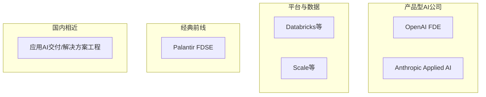

# 公司图谱与岗位差异

不同公司的「FDE」标题相近，**面试回路、日常比例、技术栈**差很多。投递前先对齐类型，避免用错备面策略。

> 公开信息会随团队与年份变化；**以招聘官说明为准**。下文为 2025–2026 公开报道与社区信息的综合画像。

---

## 1. 四类雇主地图

| 类型 | 代表 | 工作重心 | 面试偏重 |
|------|------|----------|----------|
| 经典前线 | Palantir FDSE | 复杂机构、数据融合、所有权与拆解 | 编码 + Decomposition + Learning |
| 产品型 AI | OpenAI FDE | 企业落地 GPT/Agent、生产化与客户方案 | Take-home、RAG/Eval、方案设计 |
| 安全取向 AI | Anthropic Applied AI | 可靠、安全、受监管环境部署 | LLM 系统设计、Eval、价值观 |
| 平台型 | Databricks 等 | 湖仓/ML 平台上的客户价值 | 数据栈 + 方案 + 工程 |
| 国内相近 | 大厂应用 AI、AI 创业公司交付 | 行业方案、私有化、陪跑 | 项目深挖、业务理解、工程落地 |

---

## 2. Palantir FDSE（画像）

**角色气质**：高强度工程 + 模糊问题拆解；「在别人的代码与数据里快速变得有用」。

**公开报道中的常见轮次**（综合 The Forward Deployed 等，截至约 2026）：

| 阶段 | 测什么 |
|------|--------|
| Recruiter | 动机、是否接受前线节奏 |
| Technical screen | 实用编码（常偏图/数据），有时 SQL |
| Onsite | Decomposition / Coding / Learning / Re-engineering 等组合 |
| Hiring manager | 使命感、ownership、开放问题 |

**备面含义**：算法可以准备，但更要练 **Decomposition 口述** 与 **1 小时读懂陌生库并扩展**。详见 [Decomposition](../04-面试通关/Decomposition拆解面.md)、[编码与 Learning](../04-面试通关/编码与Learning轮.md)。

---

## 3. OpenAI FDE（画像）

**角色气质**：把模型能力嵌进 Fortune 级工作流；强调可演示、可评测、可上线。

**公开报道中的常见元素**：

| 阶段 | 测什么 |
|------|--------|
| Recruiter | 为什么做 forward-deployed |
| Take-home | 基于 API 的真实工件 + **录屏演示** |
| Technical deep dive | RAG、微调权衡、guardrails、eval |
| Solution design | 开放客户场景方案 |
| HM / Values | 协作与价值观 |

**备面含义**：做一个「生产形」小项目（eval + 数据边界 + 成本延迟 + rollout）比刷题更重要。见 [Take-home 与演示](../04-面试通关/Take-home与演示.md)。

---

## 4. Anthropic Applied AI / FDE（画像）

**角色气质**：企业环境中安全、可评估地部署 Claude；把一次性项目变成可重复模式。

**社区与公开讨论常强调**：

- LLM 系统设计（权限、审计、HITL、监控）
- 「Users liked the demo」不够，要有 eval 与失败分析
- 行为面：失败部署、对不切实际需求的推回、使命对齐

**备面含义**：准备 1–2 个「受监管或高风险场景」的完整答法（法务合同、金融分析、内部知识库等）。

---

## 5. 平台型与其他（简表）

| 公司/类型 | 你可能整天接触 | 相对差异 |
|-----------|----------------|----------|
| Databricks 等 | Lakehouse、作业、治理、AI 功能 | 数据工程权重更高 |
| Scale 等 | 数据、评估、政府/企业场景 | 项目类型跨度大 |
| AI 垂直创业公司 | 少数大客户陪跑 | 更「全科医生」，资源少 |

---

## 6. 国内「相近岗位」怎么映射

国内标题可能是：应用算法工程师（交付向）、解决方案工程师、AI 实施顾问、驻场研发、行业专家 + 工程等。

| 你看 JD 里的信号 | 更接近 |
|------------------|--------|
| 长期驻场、验收指标、私有化部署 | FDE |
| 售前 Demo、投标、赢单 | SE |
| 只写模型论文指标、不上生产 | 研究/中台算法 |
| 只做标准 SaaS 配置 | 实施顾问（工程深度可能不足） |

转岗策略：用本库 **方法论 + AI 落地 + 一个可演示项目** 讲故事，比纠结英文标题更有效。

---

## 7. 选择目标时的决策问题

1. 你更想 **深度工程** 还是 **客户+AI 方案**？
2. 能否接受 **出差/驻场** 与不规则工时？
3. 你有没有 **可讲述的客户/跨部门结果**？
4. 目标公司要不要 **强算法面试**？（Palantir 编码更硬，部分 AI 公司更偏应用）

输出一张表：公司 → 匹配度 1–5 → 缺口 → 备面重点轮。

---

## 8. 读完马上做

- [ ] 选出 2 类雇主类型，而不是 20 个公司名
- [ ] 打开目标公司最新 JD，用本文表格标注「编码 / 拆解 / Take-home / 安全」权重
- [ ] 进入 [能力模型与成长路径](./能力模型与成长路径.md)

## 参考与来源

| 来源 | 链接 | 本篇用法 |
|------|------|----------|
| Exponent FDE 2026 Guide | https://www.tryexponent.com/blog/forward-deployed-engineer-interview-the-definitive-2026-guide-fde | 多公司对照综述 |
| The Forward Deployed — Palantir | https://www.theforwarddeployed.io/interviews/palantir | 轮次结构精读要点 |
| The Forward Deployed — OpenAI | https://www.theforwarddeployed.io/interviews/openai | Take-home 与深挖要点 |
| Reddit — Anthropic FDE 讨论 | https://www.reddit.com/r/OfferEngineering/comments/1uc8ocr/anthropic_forward_deployed_engineer_fde_interview/ | Applied AI 侧重点综述 |
| 各公司 Careers 页 | 见 [sources.md](../../references/sources.md) | 官方称谓对照 |
