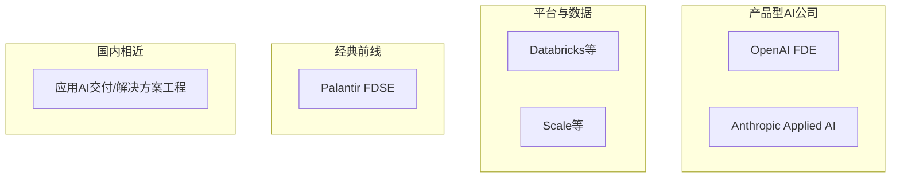

# 公司图谱与岗位差异

不同公司的「FDE」标题相近，**面试回路、日常比例、技术栈**差很多。投递前先对齐类型，避免用错备面策略。

> 公开信息会随团队与年份变化；**以招聘官说明为准**。下文为 2025–2026 公开报道与社区信息的综合画像。

---

## 1. 四类雇主地图

```mermaid
flowchart TB
  subgraph productAI [产品型AI公司]
    OpenAI[OpenAI FDE]
    Anthropic[Anthropic Applied AI]
  end
  subgraph platform [平台与数据]
    Databricks[Databricks等]
    Scale[Scale等]
  end
  subgraph classic [经典前线]
    Palantir[Palantir FDSE]
  end
  subgraph cn [国内相近]
    CN[应用AI交付/解决方案工程]
  end
```

| 类型 | 代表 | 工作重心 | 面试偏重 |
|------|------|----------|----------|
| 经典前线 | Palantir FDSE | 复杂机构、数据融合、所有权与拆解 | 编码 + Decomposition + Learning |
| 产品型 AI | OpenAI FDE | 企业落地 GPT/Agent、生产化与客户方案 | Take-home、RAG/Eval、方案设计 |
| 安全取向 AI | Anthropic Applied AI | 可靠、安全、受监管环境部署 | LLM 系统设计、Eval、价值观 |
| 平台型 | Databricks 等 | 湖仓/ML 平台上的客户价值 | 数据栈 + 方案 + 工程 |
| 国内相近 | 大厂应用 AI、AI 创业公司交付 | 行业方案、私有化、陪跑 | 项目深挖、业务理解、工程落地 |

---

## 2. Palantir FDSE（画像）

**角色气质**：高强度工程 + 模糊问题拆解；「在别人的代码与数据里快速变得有用」。

**公开报道中的常见轮次**（综合 The Forward Deployed 等，截至约 2026）：

| 阶段 | 测什么 |
|------|--------|
| Recruiter | 动机、是否接受前线节奏 |
| Technical screen | 实用编码（常偏图/数据），有时 SQL |
| Onsite | Decomposition / Coding / Learning / Re-engineering 等组合 |
| Hiring manager | 使命感、ownership、开放问题 |

**备面含义**：算法可以准备，但更要练 **Decomposition 口述** 与 **1 小时读懂陌生库并扩展**。详见 [Decomposition](../04-面试通关/Decomposition拆解面.md)、[编码与 Learning](../04-面试通关/编码与Learning轮.md)。

---

## 3. OpenAI FDE（画像）

**角色气质**：把模型能力嵌进 Fortune 级工作流；强调可演示、可评测、可上线。

**公开报道中的常见元素**：

| 阶段 | 测什么 |
|------|--------|
| Recruiter | 为什么做 forward-deployed |
| Take-home | 基于 API 的真实工件 + **录屏演示** |
| Technical deep dive | RAG、微调权衡、guardrails、eval |
| Solution design | 开放客户场景方案 |
| HM / Values | 协作与价值观 |

**备面含义**：做一个「生产形」小项目（eval + 数据边界 + 成本延迟 + rollout）比刷题更重要。见 [Take-home 与演示](../04-面试通关/Take-home与演示.md)。

---

## 4. Anthropic Applied AI / FDE（画像）

**角色气质**：企业环境中安全、可评估地部署 Claude；把一次性项目变成可重复模式。

**社区与公开讨论常强调**：

- LLM 系统设计（权限、审计、HITL、监控）
- 「Users liked the demo」不够，要有 eval 与失败分析
- 行为面：失败部署、对不切实际需求的推回、使命对齐

**备面含义**：准备 1–2 个「受监管或高风险场景」的完整答法（法务合同、金融分析、内部知识库等）。

---

## 5. 平台型与其他（简表）

| 公司/类型 | 你可能整天接触 | 相对差异 |
|-----------|----------------|----------|
| Databricks 等 | Lakehouse、作业、治理、AI 功能 | 数据工程权重更高 |
| Scale 等 | 数据、评估、政府/企业场景 | 项目类型跨度大 |
| AI 垂直创业公司 | 少数大客户陪跑 | 更「全科医生」，资源少 |

---

## 6. 国内「相近岗位」怎么映射

国内标题可能是：应用算法工程师（交付向）、解决方案工程师、AI 实施顾问、驻场研发、行业专家 + 工程等。

| 你看 JD 里的信号 | 更接近 |
|------------------|--------|
| 长期驻场、验收指标、私有化部署 | FDE |
| 售前 Demo、投标、赢单 | SE |
| 只写模型论文指标、不上生产 | 研究/中台算法 |
| 只做标准 SaaS 配置 | 实施顾问（工程深度可能不足） |

转岗策略：用本库 **方法论 + AI 落地 + 一个可演示项目** 讲故事，比纠结英文标题更有效。

---

## 7. 选择目标时的决策问题

1. 你更想 **深度工程** 还是 **客户+AI 方案**？
2. 能否接受 **出差/驻场** 与不规则工时？
3. 你有没有 **可讲述的客户/跨部门结果**？
4. 目标公司要不要 **强算法面试**？（Palantir 编码更硬，部分 AI 公司更偏应用）

输出一张表：公司 → 匹配度 1–5 → 缺口 → 备面重点轮。

---

## 8. 备面资源速链（按类型）

| 类型 | 先读 |
|------|------|
| Palantir | [Palantir 面试指南](../04-面试通关/Palantir-FDSE面试指南.md)、[Decomposition](../04-面试通关/Decomposition拆解面.md) |
| OpenAI 类 | [OpenAI 指南](../04-面试通关/OpenAI-FDE面试指南.md)、[Take-home](../04-面试通关/Take-home与演示.md) |
| Anthropic 类 | [Anthropic 指南](../04-面试通关/Anthropic-FDE面试指南.md)、[Eval/护栏](../03-AI落地/评测Eval与Guardrails.md) |
| 初创 | [AI 初创指南](../04-面试通关/AI初创公司面试指南.md)、[客户模拟](../04-面试通关/客户模拟操练.md) |
| 平台/数据 | [Snowflake/Databricks](../05-能力补强/Snowflake与Databricks现场.md)、[数据工程](../05-能力补强/数据工程基石课程.md) |

JD 用语对照：[Careers 精读](../07-外文精读/06-各公司Careers岗位描述对照.md)。

---

## 9. 目标公司短名单模板

| 公司 | 类型 | 匹配 1–5 | 缺口 | 备面第一轮 | 差旅可否 |
|------|------|----------|------|------------|----------|
| | | | | | |
| | | | | | |

只保留匹配 ≥3 且差旅可接受的 2–4 家做深投。

---

## 10. 多公司「同一标题、不同使命」（现场声音）

> 补充自 [South Park Commons FDE 专题](https://www.youtube.com/watch?v=hWuoH-ODDNc)。投递前用「使命句」对齐，比只看标题更准。

| 公司 | 公开讨论中的 FDE 使命（意译） | 备面含义 |
|------|------------------------------|----------|
| **RAMP** | 赢得 upmarket 企业客户的「剑与盾」：FDE 冲交易，保护核心路线图不被企业定制拖垮 | 强调商业结果、在核心代码库里克制变更、一人数客户 |
| **Nominal** | 帮客户成功 + 摸清产品最前沿，把共享基础设施拉回核心产品 | 强调可泛化实现、「把路线图向左拉」、防咨询化 |
| **Dataland** | 公司生命线：按客户构建异质智能体，卖的是可运行的「劳动力」而非大平台 PPT | 强调经常性价值、学习飞轮、元智能体加速下一次交付 |
| **OpenAI** | 企业端「矛尖」：① 找可重复问题做广泛采用；② 啃最难行业推模型边界 | 强调结果优先再规模化（产品或后训练）；能对「不能规模化到 ARR」说 no |
| **Factory** | 部署工程师是产品矛尖，**不做**替客户完成迁移的专业服务 | 强调回流产品、自动组装、ROI 故事从第一天写清 |
| **Cognition** | 最大化「产品能力 ∩ 客户问题」重叠；衡量结果而非 token | 强调嵌入 backlog、把现场挑战变成产品评估 |
| **Sierra** | Agent engineering / 结果定价语境下的客户责任 | 强调 outcome-based，而非席位或纯用量 |

**OpenAI 内部追问（同讨论，可迁移）：** 这能不能只是 Codex（或你们的平台原语）扩展？如果不能，必须是独立产品吗？能不能让模型变聪明直接擅长这件事？——现场项目立项时很有用。

**与 SE / SA 的边界（OpenAI 口述）：** 解决方案工程偏售前规模化动线；解决方案架构偏售后规模化动线；FDE 往往是**另一条业务单元**，一次只深啃少数参与，售前售后一体跑，且必须能对「有趣但不能变成经常性收入」的问题说 no。

---

## 11. Palantir 式分工的当代变体

| 模式 | 谁干什么 | 当代变体 |
|------|----------|----------|
| Echo + Delta | Echo：关系/用例发现；Delta：编码交付 | 仍常见，但 JD 里名字各异 |
| Nominal Mission Ops + Mission Dev | Ops 常有领域工程背景（机械/电气等）；Dev 写代码 | 「懂用户工作流」与「写平台」拆开 |
| Dataland「激进所有权」 | AI 降低代码成本后，尝试一人持有全部上下文 | 难招，但避免纯非技术人做价值决策 |
| OpenAI | FDE + Echo（大账户）+ 少量行业专家（芯片验证、生命科学） | 通才 FDE 向专家学习，专家不取代通才 |

**建议：** 面任何公司都问清——客户主管 / SE / FDE / 产品的边界在哪？FDE 与核心工程能否轮换？一人几账户？预期嵌入多久？

---

## 12. FDE「年份」简史（理解 JD 通胀）

> 补充自 [Sierra / Natalie Mirror 演讲](https://www.youtube.com/watch?v=Byv311hdoHE)。把所有招聘帖合并，会得到荒谬画像：「8 年 Staff + 6 年直销 + 4 年 SA + 最好教过书」——这正是标题通胀的感受。

| 大致年代（Palantir 主线） | FDE 主业重心 |
|---------------------------|--------------|
| ~2008 | 更像 DevOps：部署、稳定性、凌晨灭火 |
| ~2012 | DevOps + 数据集成；本体（ontology）建模让数据可用 |
| Slate / Foundry | 让数据产生决策价值；发现「不能写回的仪表盘会衰减」 |
| ~2020 前后 | 平台化与客户赋能（如 Airbus Skywise），减少「派人飞往现场」依赖 |
| 2024–2026 | 标题爆炸；工作量叠加而非替换；Agent / 结果定价进入日常 |

**读 JD 技巧：** 问「这家要的是哪一年份的 FDE？」——偏集成运维、偏数据本体、偏 Agent 生产化、还是偏客户赋能？再决定备面权重。

---

## 13. 读完马上做

- [ ] 选出 2 类雇主类型，而不是 20 个公司名
- [ ] 打开目标公司最新 JD，用本文表格标注「编码 / 拆解 / Take-home / 安全」权重
- [ ] 用 §10 给目标公司写一句「使命对齐」；写不清就先别投
- [ ] 填短名单模板
- [ ] 进入 [能力模型与成长路径](./能力模型与成长路径.md)

## 参考与来源

| 来源 | 链接 | 本篇用法 |
|------|------|----------|
| Exponent FDE 2026 Guide | https://www.tryexponent.com/blog/forward-deployed-engineer-interview-the-definitive-2026-guide-fde | 多公司对照综述 |
| The Forward Deployed — Palantir | https://www.theforwarddeployed.io/interviews/palantir | 轮次结构精读要点 |
| The Forward Deployed — OpenAI | https://www.theforwarddeployed.io/interviews/openai | Take-home 与深挖要点 |
| Reddit — Anthropic FDE 讨论 | https://www.reddit.com/r/OfferEngineering/comments/1uc8ocr/anthropic_forward_deployed_engineer_fde_interview/ | Applied AI 侧重点综述 |
| YouTube — SPC FDE 专题 | https://www.youtube.com/watch?v=hWuoH-ODDNc | §10–11 多公司使命与团队结构 |
| YouTube — Sierra / Natalie Mirror | https://www.youtube.com/watch?v=Byv311hdoHE | §12 FDE 年份简史 |
| YouTube — Factory Deployed Engineering | https://www.youtube.com/watch?v=wpOA-UXynoM | §10 Factory 定位 |
| YouTube — Cognition 部署工程 | https://www.youtube.com/watch?v=RVxym6mmIns | §10 Cognition 定位 |
| 各公司 Careers 页 | 见 [sources.md](../../references/sources.md) | 官方称谓对照 |
