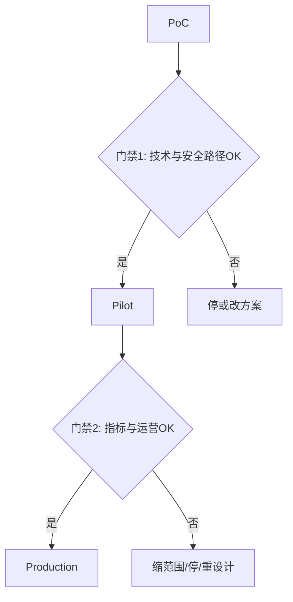

# 从 POC 到生产

很多 AI 项目死在「Demo 很惊艳，生产遥遥无期」。FDE 的核心交付能力之一，就是把 **PoC → Pilot → Production** 变成有出口条件的楼梯，而不是口号。

---

## 1. 三阶段定义

| 阶段 | 目的 | 数据/用户 | 成功样子 |
|------|------|-----------|----------|
| **PoC** | 技术可行性 | 可用脱敏/抽样；用户可少 | 「这条技术路径在约束下走得通」 |
| **Pilot** | 业务可行性 | 真实数据与真实用户子集 | 「指标相对基线有意义改善，且可运营」 |
| **Production** | 可持续运行 | 完整权限、观测、值班、SLA | 「可交接、可回滚、可扩容或可复制」 |

**PoC 成功 ≠ 可以全员开放。** 书面写清，避免被营销叙事绑架。

---

## 2. 楼梯上的门禁

### 门禁 1（PoC → Pilot）建议条件

- [ ] 关键路径在**目标网络与数据驻留**约束下可运行（不是仅在笔记本）
- [ ] 权限模型草图通过安全初审
- [ ] 有初步 eval（哪怕 20–50 条）显示并非随机水平
- [ ] 已知最大风险与缓解
- [ ] 书面试点范围（用户 × 内容 × 时间）

### 门禁 2（Pilot → Production）建议条件

- [ ] 达到约定指标或有书面「有条件上线」决策
- [ ] 观测、告警、回滚、审计齐备
- [ ] Runbook + 培训完成；客户侧 owner 指定
- [ ] 成本模型可接受
- [ ] 支持与变更流程明确

验收表：[POC 验收表](../08-工具箱与清单/POC验收表.md)、[Go-Live 清单](../08-工具箱与清单/生产Go-Live清单.md)

---

## 3. 试点范围设计（最重要的产品决策）

好的试点：**窄、真、可测、可叙事**。

| 维度 | 差 | 好 |
|------|----|----|
| 用户 | 全公司 | 一个团队 10–30 人 |
| 内容 | 全部知识库 | 一个产品线文档 |
| 自动化 | 马上全自动对外 | 先助手 / 影子模式 |
| 时间 | 做完再说 | 4 周时间盒 |
| 指标 | 「大家觉得好」 | 采纳率、时长、差错 |

---

## 4. 数据与权限：生产的隐藏主线

从第一天就问：

1. 数据能否出域？需不需要私有化 / VPC？
2. 身份从哪来（SSO）？授权如何映射到文档级？
3. 提示词与日志里是否落 PII？保留多久？
4. 工具调用是否可能越权写系统？
5. 谁有权看审计记录？

**不要**用「管理员万能账号」撑过 Pilot——那会让门禁 2 永远过不去。

---

## 5. 变更管理与培训

技术上线只是一半。计划：

| 动作 | 说明 |
|------|------|
| 变更说明 | 用户工作流哪里变、哪里不变 |
| 培训 | 30 分钟上手 + 练习工单 |
| 支持频道 | 第一周每日答疑 |
| 激励 | 与考核对齐；避免「又多一个系统」 |
| 反馈环 | 错误一键上报进入 eval 集 |

---

## 6. 交接（Handoff）

FDE 不是永久外包研发。交接包最少包括：

- 架构图与数据流
- 环境与密钥归属
- Runbook / 故障演练记录
- Eval 集与如何回归
- 已知限制与路线图建议
- 值班与升级路径

若客户无法接手，生产责任模型要在 Review 里升级（继续陪跑 / 缩范围 / 产品化）。

---

## 7. 常见失败模式

| 失败 | 表现 | 缓解 |
|------|------|------|
| Demo 绑架 | 管理层要下周全员 | 门禁书面化 |
| 永久 PoC | 环境永远是特例 | 门禁 1 卡「目标环境」 |
| 无 owner | 你走了就停 | 指定客户 owner |
| 指标漂移 | 不断改「什么叫成功」 | 冻结试点指标 |
| 阴影 IT | 绕过安全 | 早拉安全，给替代方案 |

更多见 [反模式与踩坑](./反模式与踩坑.md)。

---

## 8. 读完马上做

- [ ] 为虚构项目写门禁 1/2 各 5 条
- [ ] 用一页纸定义试点切片
- [ ] 阅读 [客户沟通与阻力处理](./客户沟通与阻力处理.md)

## 参考与来源

本文为原创交付实践；与公开 FDE 岗位中「pilot to production」叙述一致，参见 [sources.md](../../references/sources.md) S01/S03。
