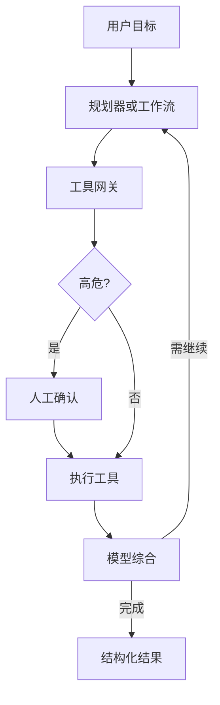

# Agent 与工具调用

当任务需要**多步推理 + 读/写外部系统**时，会用到 Agent 或「工作流 + 工具调用」。FDE 的重点不是炫技自主性，而是 **权限、可撤销性、可观测、人机回环**。

---

## 1. 先分清三种形态

| 形态 | 描述 | 何时用 |
|------|------|--------|
| 单次工具调用 | 模型选一个函数，你执行 | 查询库存、拉工单 |
| 固定工作流 | 状态机/编排，步骤确定 | 企业默认首选 |
| 自主 Agent | 模型自己规划多步 | 探索性、工具少、可逆 |

**生产默认：能用工作流就不要给无限自主。** 面试里这样答显成熟。

---

## 2. 工具设计原则

1. **最小权限**：工具本身受调用者身份约束  
2. **强类型参数**：schema 校验，防胡参  
3. **幂等与确认**：写操作要幂等键；高危要 HITL  
4. **可解释**：记录「为何调、参数、结果摘要」  
5. **超时与重试策略**：明确失败返回给模型的信息  
6. **禁止**：`run_sql_raw(any)`、`shell(any)` 之类超级工具  

### 工具分级

| 级别 | 例子 | 策略 |
|------|------|------|
| L0 只读 | 搜索文档、查订单状态 | 可自动 |
| L1 低危写 | 创建草稿工单 | 可自动或抽检 |
| L2 高危写 | 退款、改权限、发外部邮件 | 强制 HITL |
| L3 不可逆 | 删除、转账 | 默认不做或双人审批 |

---

## 3. 人机回环（HITL）模式

| 模式 | 行为 |
|------|------|
| 影子 | Agent 建议，人不执行 |
| 确认 | 展示计划，人点批准后执行 |
| 介入 | 关键步必须人填 |
| 事后审计 | 自动执行 + 抽样复核（仅低危） |

向客户解释时用业务语言：「系统先起草，财务点同意才付款。」

---

## 4. 权限代理模型

常见错误：Agent 用服务账号拥有全世界权限。

正确方向：

```text
用户身份 → 令牌/会话 → 工具网关（鉴权、限流、ACL）→ 后端系统
```

模型**不应**直接持有万能密钥；由网关按用户权限调用。

---

## 5. MCP / 工具生态（概念层）

**MCP（Model Context Protocol）** 等协议的目标是：用标准方式把工具与数据源接到模型应用。对 FDE：

- 关心的是：**谁能装什么服务器、审计、审批**  
- 不要在面试里背协议细节装懂；要会讲「工具网关 + 权限 + 审计」  

---

## 6. 参考控制回路



---

## 7. 失败与安全

| 风险 | 缓解 |
|------|------|
| 提示注入（文档里藏指令） | 工具层不信任文档指令；分隔证据与指令 |
| 循环调用 | 步数上限、重复检测、预算 |
| 部分失败 | 事务边界；补偿动作 |
| 幻觉参数 | schema + 业务校验 |
| 数据外泄 | 出站 DLP；工具返回脱敏 |

对齐 [OWASP LLM](../../references/sources.md) 风险意识与 [Guardrails](./评测Eval与Guardrails.md)。

---

## 8. Eval 怎么测 Agent

- 任务成功率（最终状态是否正确）  
- 危险动作是否被拦截  
- 平均步数/成本  
- 恢复能力（工具报错后）  
- 轨迹是否可审计  

准备「会诱导乱转账」的红队用例。

---

## 9. 读完马上做

- [ ] 把一个业务任务画成固定工作流（不要 Agent）  
- [ ] 标出 L0–L2 工具与 HITL 点  
- [ ] 读 [评测 Eval 与 Guardrails](./评测Eval与Guardrails.md)

## 参考与来源

| 来源 | 链接 | 本篇用法 |
|------|------|----------|
| Anthropic / OpenAI 工具调用文档 | S20, S21 | 能力对照 |
| 社区 Applied AI 面试讨论 | S05 | 强调权限与 eval |
| 本文 | — | 原创实践 |
