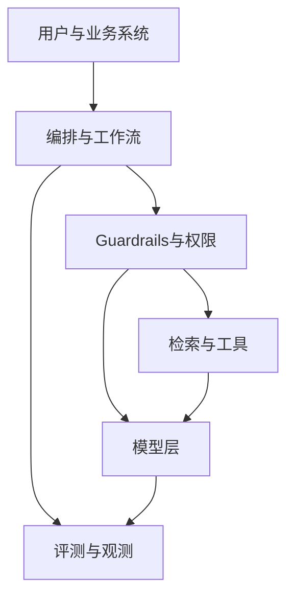

# 企业 AI 落地全景

面向已有后端/全栈经验的读者：把「上 LLM」当成**受约束的系统设计问题**，而不是模型选秀。本篇解决：做什么、不做什么、怎么切第一刀。

---

## 1. 企业落地的真实目标

企业买的不是「会聊天」，而是在约束下改善：

- 效率（时长、吞吐）
- 质量（差错、一致性）
- 体验（等待、可达性）
- 风险（合规、欺诈、安全）
- 成本（人工、软件、模型账单）

FDE 要能把用例映射到上述某一类，并定义**可测指标**。

---

## 2. 用例地图（按模式）

| 模式 | 例子 | 典型风险 |
|------|------|----------|
| 检索问答 / Copilot | 制度、产品、代码助手 | 过期知识、权限穿透 |
| 文档理解 | 合同、发票、简历信息抽取 | 结构化误差、法律责任 |
| 生成与改写 | 邮件、报告草稿 | 品牌、泄密 |
| 分类与路由 | 工单分派、风险分级 | 偏差、漂移 |
| 智能体工作流 | 多步工具调用办结任务 | 越权、不可逆动作 |
| 语音/多模态 | 质检、现场巡检 | 隐私、环境噪声 |

同一客户往往同时要多种模式——**试点只选一种主模式**。

---

## 3. 何时不要用 LLM（先说不）

优先考虑规则、搜索、传统 ML、RPA、或改进流程本身，当：

1. 问题已有稳定规则且输入结构化（「LLM 杀鸡」）
2. 需要严格可复现的计算（计价、结算）——LLM 可做辅助解释，不做账本
3. 错误代价极高且无法 HITL，又短期内做不出可靠 eval
4. 数据无法合法使用，又无私有化路径
5. 真正瓶颈是组织扯皮而非认知任务
6. 延迟/成本预算与生成式方案根本不兼容

「不用 LLM」在面试与现场都是加分项——显示判断力。

---

## 4. 落地分层架构（概念）

| 层 | 你要决定的事 |
|----|----------------|
| 体验 | 嵌入现有 UI 还是新入口；助手 vs 自动 |
| 编排 | 同步/异步；状态机 vs 自由 Agent |
| 护栏 | 输入输出策略、权限、拒答 |
| 知识/工具 | RAG、API、DB；写操作是否允许 |
| 模型 | 外呼 API / 私有；主模型与小模型分工 |
| 运营 | Eval、日志、反馈、成本 |

---

## 5. 选型序（推荐默认顺序）

1. **流程与指标**是否清楚？  
2. **权限与数据**是否可解？  
3. **Prompt + 工具/RAG** 能否到可用？  
4. 是否需要 **工作流约束**（少 Agent 自由度）？  
5. 是否真的需要 **微调**？（通常更晚）  
6. 是否需要 **多 Agent**？（最后考虑）

决策细节：[架构决策树](./架构决策树.md)

---

## 6. 第一刀怎么切（两周试点配方）

1. 一个用户角色 + 一个任务类型  
2. 一个知识子集或一个工具集  
3. 50–200 条黄金集（含应拒答）  
4. 人机回环默认开  
5. 量采纳率/时长，不只量「模型分」  
6. 每天看失败案例 30 分钟  

---

## 7. 与客户 IT 的共同语言

准备一页「非 ML 语言」说明：

- 数据流进出来向  
- 是否持久化提示与文档  
- 身份如何传到检索层  
- 故障时降级行为（只检索 / 转人工）  
- 供应商与分包（模型提供商）

---

## 8. 读完马上做

- [ ] 列出 3 个你熟悉的业务：做 / 不做 / 以后做  
- [ ] 给「做」的那个写指标与非目标  
- [ ] 读 [RAG 实战精要](./RAG实战精要.md) 或 [决策树](./架构决策树.md)

## 参考与来源

| 来源 | 链接 | 本篇用法 |
|------|------|----------|
| OpenAI / Anthropic 文档实践 | S20, S21 | 生产实践对照 |
| OWASP LLM Top 10 | S23 | 风险意识 |
| 本文 | — | 原创全景 |
