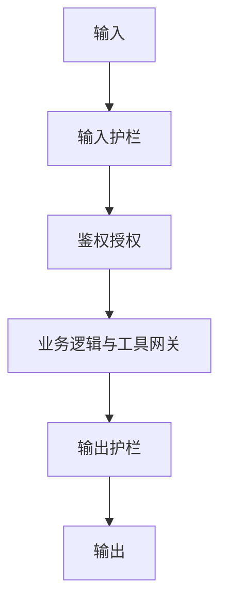

# 评测 Eval 与 Guardrails

没有 Eval 的 AI 项目是**无法管理的 Demo**。Guardrails 则是把「已知风险」变成工程控制。二者是 FDE 与「会调 prompt 的人」的分水岭。

---

## 1. Eval 在交付中的位置

| 阶段 | Eval 做什么 |
|------|-------------|
| Discover | 定义「好」的业务含义 |
| Design | 设计集、量规、通过线 |
| Deploy | 每次改动回归；分析失败 |
| Review | 证明指标；决定扩大/停止 |

口头「感觉更好」不能过门禁。

---

## 2. 建立 Golden Set

### 来源

- 真实历史查询/工单（脱敏）  
- 专家编写的标准问答案  
- 故意困难例与对抗例  
- 权限/拒答例  

### 分层抽样

按意图、产品线、难度、语言、是否需工具等分层，避免只测「好答的」。

### 规模直觉

| 阶段 | 规模直觉 |
|------|----------|
| 烟测 | 20–50 |
| Pilot | 100–300 |
| 生产回归 | 持续增长；核心集每次必跑 |

质量 > 数量；错误标签比没标签更糟。

---

## 3. Rubric（量规）示例

**问答类（0–2 分）**

- 2：正确且有恰当证据/引用  
- 1：部分正确或缺引用  
- 0：错误、有害或该拒不拒  

**助手采纳类**：以人的行为为准——建议是否被采纳、是否缩短时长。

**Agent 类**：最终业务状态是否正确 + 是否触发未批准高危动作。

可先人工，再辅以模型判分（**模型裁判要抽检**）。

---

## 4. 自动化与人工的组合

| 类型 | 适合 | 局限 |
|------|------|------|
| 精确匹配/字段 F1 | 抽取、分类 | 开放生成不适用 |
| 引用检测 | RAG | 需源对齐 |
| LLM-as-judge | 流畅性、格式 | 有偏，需校准 |
| 人工专家 | 高风险域 | 成本高 |
| 线上指标 | 采纳率、CSAT | 滞后 |

---

## 5. 失败分析流程（每周）

1. 跑回归，取出失败与临界例  
2. 归类：检索 / 权限 / 指令 / 工具 / 标注错误  
3. 每类选代表例进「错误本」  
4. 改一个因素就重测，避免同时改十处  
5. 把新发现的坑补进黄金集  

---

## 6. Guardrails 分层

| 层 | 例子 |
|----|------|
| 输入 | 注入检测、长度限制、密钥/身份证模式脱敏 |
| 授权 | SSO、租户、文档 ACL |
| 业务 | 工具允许列表、额度、HITL |
| 输出 | 毒害/泄密扫描、格式校验、强制引用 |
| 运营 | 审计、告警、熔断（错误率飙升则降级） |

参考风险清单思路：OWASP Top 10 for LLM（提示注入、数据泄漏、不安全插件等）。

---

## 7. 线上监控（与离线 Eval 互补）

- 延迟、token 成本、错误率  
- 拒答率突变  
- 用户负反馈  
- 工具失败率  
- 权限拒绝率（过高也可能是集成 bug）  

告警要接到**能修的人**，并有 Runbook。

---

## 8. 对客户怎么讲 Eval

避免：「我们准确率 93%。」  
推荐：「在冻结的 120 条分层集上，引用正确率 86%，应拒答命中 10/10；线上坐席采纳率 41%。已知弱点是表格类，本月专项。」

---

## 9. 读完马上做

- [ ] 写 20 条黄金题 + 简单 0–2 量规  
- [ ] 列出输入/输出护栏各 3 条  
- [ ] 读 [生产化清单](./生产化清单.md)

## 参考与来源

| 来源 | 链接 | 本篇用法 |
|------|------|----------|
| OWASP Top 10 for LLM | https://owasp.org/www-project-top-10-for-large-language-model-applications/ | 风险与护栏对照 |
| OpenAI FDE 面试侧重点（eval） | S03 | 强调生产形评测 |
| 本文 | — | 原创实践 |
