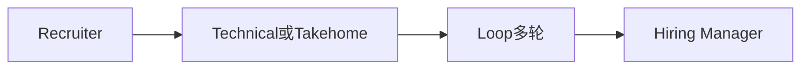

# 面试全景与公司对照

FDE 面试不是标准后端 LeetCode 流水线，而是 **工程能力 × 问题拆解 × 客户判断 ×（常有）AI 生产化** 的组合。本篇帮你按目标公司分配备面时间。

> 轮次随团队/年份变化，**以招聘官邮件为准**。以下为公开报道与社区信息的综合画像（约 2025–2026）。

---

## 1. 通用全景

| 轮次类型 | 考什么 | 你要展示 |
|----------|--------|----------|
| Recruiter | 动机、前线意愿、沟通 | 清晰故事：为何 FDE |
| Coding | 实用工程 | 正确、可读、沟通 |
| Decomposition | 模糊问题拆解 | 用户/指标/硬点/下一步 |
| Learning | 陌生代码库 | 快速变有用 |
| System / LLM Design | 方案 | 约束、eval、rollout |
| Take-home | 作品 + 演示 | 生产形完整度 |
| Behavioral | 所有权与冲突 | STAR + 结果 |
| HM / Values | 匹配度 | 诚实、使命、判断 |

---

## 2. 公司对照表

| 维度 | Palantir FDSE | OpenAI FDE | Anthropic Applied AI | 平台型（如 Databricks） | 国内应用 AI 交付 |
|------|---------------|------------|----------------------|-------------------------|------------------|
| 编码强度 | 高 | 中（偏应用） | 中 | 中高 | 中（项目深挖） |
| Decomposition | 极重要 | 重要 | 重要 | 中 | 以项目追问形式出现 |
| Take-home | 较少作为主线 | 常见 | 可能有 | 看团队 | 常见作业/案例 |
| LLM 深挖 | 视团队 | 很深 | 很深（安全/eval） | 平台+AI | 落地与私有化 |
| Learning 轮 | 常见 | 较少报道 | 较少报道 | 视团队 | 少 |
| 行为/价值观 | 高 | 高 | 极高 | 高 | 高（稳定性与客户） |

来源精读要点见文末；细节篇：

- [面试练习操练系统](./面试练习操练系统.md)（动手操练：编码关 / Take-home / Decomposition 三套题 + AI 面试官）
- [Decomposition](./Decomposition拆解面.md)
- [LLM 系统设计](./技术方案与LLM系统设计.md)  
- [编码与 Learning](./编码与Learning轮.md)  
- [Take-home](./Take-home与演示.md)  
- [STAR](./行为面STAR题库.md)  

---

## 3. Palantir 向备面权重（示例）

| 投入占比 | 内容 |
|----------|------|
| 30% | Decomposition 口述（计时、抗打断） |
| 30% | 实用编码（含图/数据操作、SQL） |
| 20% | Learning：1h 读陌生库并扩展 |
| 20% | 行为面与动机 |

---

## 4. OpenAI 向备面权重（示例）

| 投入占比 | 内容 |
|----------|------|
| 35% | Take-home 级项目：eval+安全+成本+rollout+演示 |
| 25% | RAG/Agent/Eval 深挖问答 |
| 20% | 方案设计（客户场景） |
| 20% | 行为面与 Why FDE |

---

## 5. Anthropic 向备面权重（示例）

| 投入占比 | 内容 |
|----------|------|
| 30% | LLM 系统设计（安全、HITL、审计） |
| 25% | Eval 与失败分析故事 |
| 20% | 编码（扎实即可） |
| 25% | 价值观、推回、使命对齐 |

---

## 6. Recruiter 电话：标准题库

准备 90 秒版本：

1. 自我介绍（背景 → 客户/结果经历 → 为何 FDE）  
2. 为何本公司（产品 + 前线模式 + 你的匹配）  
3. 能否出差/驻场  
4. 薪资区间（按你策略）  
5. 最近项目深挖预告（留钩子）  

---

## 7. 常见淘汰原因（综合公开观点）

- 一上来堆功能，不定义用户与指标  
- Demo 思维，无 eval/权限/成本  
- 不会推回，只会答应  
- 编码沟通差或无法读他人代码  
- 动机是「只想碰模型」而非交付结果  

---

## 8. 读完马上做

- [ ] 选定 1 主目标类型，按上表分配下周时间  
- [ ] 写 90 秒自我介绍并录音  
- [ ] 进入 [Decomposition 拆解面](./Decomposition拆解面.md)

## 参考与来源

| 来源 | 链接 | 本篇用法 |
|------|------|----------|
| Exponent FDE 2026 Guide | https://www.tryexponent.com/blog/forward-deployed-engineer-interview-the-definitive-2026-guide-fde | 多公司全景综述 |
| The Forward Deployed — Palantir | https://www.theforwarddeployed.io/interviews/palantir | 轮次精读要点 |
| The Forward Deployed — OpenAI | https://www.theforwarddeployed.io/interviews/openai | Take-home/深挖要点 |
| Reddit — Anthropic FDE | https://www.reddit.com/r/OfferEngineering/comments/1uc8ocr/anthropic_forward_deployed_engineer_fde_interview/ | Applied AI 侧重点 |
