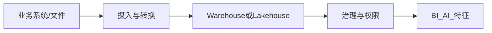

# Snowflake 与 Databricks 现场精要

FDE 在数据平台型客户（或 Databricks 类雇主）常要在 **Lakehouse / 云数仓** 上交付，而不是只调 Chat API。本篇给你「能跟数据平台同事对话并完成试点」的最小深度。

---

## 1. 你需要能解释的一张图

| 层 | Snowflake 语境 | Databricks 语境 |
|----|----------------|-----------------|
| 存储计算 | 云数仓；虚拟 Warehouse 管算力 | Lakehouse；集群/SQL Warehouse/Serverless |
| 表格式 | 原生表 + 外部表等 | Delta Lake 等 |
| 治理 | Role/RBAC、Row Access、脱敏 | Unity Catalog 等 |
| 作业 | Task/动态表/合作伙伴 ETL | Jobs/Workflows/DBT 等 |
| AI | Cortex 等能力随产品演进 | Mosaic AI 等能力随产品演进 |

产品名更新快——**以客户租户实测与官网文档为准**；本篇教稳定概念。

---

## 2. FDE 现场高频任务

1. **探查**：有哪些主题域、口径主人、刷新频率、质量坑  
2. **权限**：服务账号 vs 用户身份；行级/列级；AI 检索能否继承  
3. **性能与成本**：谁在跑全表扫描；Warehouse/集群尺寸；自动挂起  
4. **为 AI 备数**：宽表 vs 语义层；PII 列；只读副本  
5. **落地**：把评测集与线上日志落到可查询表  

---

## 3. 权限模型直觉（两边通用）

| 问题 | 好习惯 |
|------|--------|
| AI 服务用什么身份？ | 最小权限角色；按主题授权 |
| 用户差异可见性？ | 行级策略 / 视图；勿在应用层「假装」 |
| 训练/日志？ | 明确是否允许；隔离沙箱库 |
| 对外分享？ | 安全视图 + 审批；勿直接分享底层表 |

与 [企业 SSO 与权限](./企业SSO与权限模型.md) 一起读。

---

## 4. 给 Text-to-SQL / 分析助手的平台清单

- [ ] 只读角色 + 表白名单  
- [ ] 查询超时与资源队列  
- [ ] 官方指标表/语义层存在且有 owner  
- [ ] 成本归因标签（user/team）  
- [ ] 审计：谁跑了什么 SQL  

案例见 [限域数据分析助手](../06-行业案例/06-限域数据分析助手.md)。

---

## 5. 两周自学微路径

| 天 | 动作 |
|----|------|
| 1–2 | 官网 Quickstart：建库表、跑 SQL、看权限对象 |
| 3–4 | 做一个「每日销售」小模型 + 文档口径 |
| 5–6 | 配置只读角色；用第二用户验证不可见 |
| 7–8 | 写一个定时作业刷新宽表 |
| 9–10 | 把 20 条业务问题写成金标 SQL |
| 11–14 | 接一个最小 NL→SQL Demo（护栏齐全） |

---

## 6. 与客户开会时的好问题

1. 数据的「单一真相」在哪张表/哪个域？  
2. 刷新 SLA？迟到时业务怎么办？  
3. 行级权限今天如何实现？  
4. 谁为指标口径签字？  
5. 开发/测试/生产如何隔离？  
6. 月度计算账单谁买单、如何告警？  

---

## 7. 面试怎么讲

「我在 Snowflake/Databricks 上为 X 主题建了只读语义层与金标 SQL，AI 助手只能打白名单，成本按团队归因；权限与仓库策略由平台同事评审。」——比「用过某个 AI SQL 插件」强。

## 参考与来源

| 来源 | 链接 | 本篇用法 |
|------|------|----------|
| Snowflake 文档 | https://docs.snowflake.com/ | 概念对照 |
| Databricks 文档 | https://docs.databricks.com/ | 概念对照 |
| 本文 | — | 原创现场精要 |
