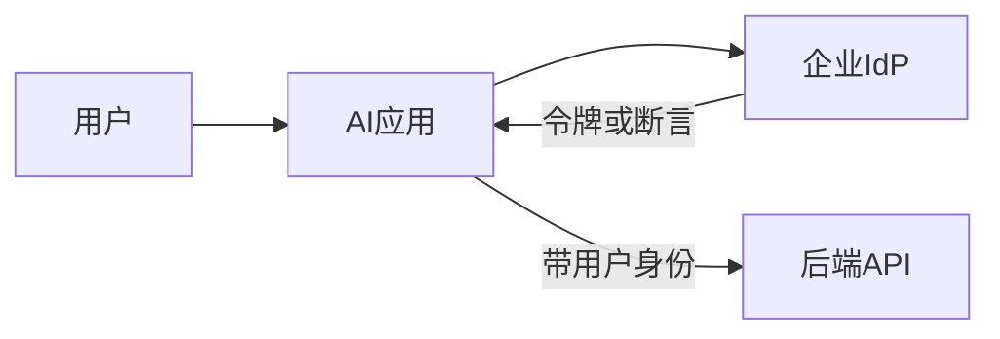

# 企业 SSO 与权限模型

AI 项目最常见的生产卡点不是模型，而是 **身份与授权**。本篇让你会画图、会提问、会在检索/工具层强制 ACL。

---

## 1. 基本概念

| 词 | 含义 |
|----|------|
| **认证 Authentication** | 你是谁（登录） |
| **授权 Authorization** | 你能做什么/看什么 |
| **SSO** | 企业统一登录（一次登录多系统） |
| **IdP** | 身份提供方（Okta、Azure AD/Entra、企业微信/飞书等视客户） |
| **SP / 应用** | 你的 AI 应用作为服务提供方 |
| **RBAC** | 按角色授权 |
| **ABAC** | 按属性（部门、地域、密级）授权 |
| **ACL** | 对象级访问控制列表（文档/行） |

---

## 2. 登录链路（白话）

常见协议族：OIDC / OAuth2、SAML。FDE 不必背全规范，但要知道：

1. 用户浏览器被重定向到 IdP  
2. 回来时应用拿到**可验证的身份断言**  
3. 后端必须验证令牌，**不信任**前端自称  

---

## 3. AI 系统里的授权落点（关键）

| 落点 | 正确做法 | 错误做法 |
|------|----------|----------|
| 检索 | 查询前按用户过滤可文档集合 | 先检索再靠 prompt「别看」 |
| 工具 | 网关用用户身份调下游；或严格模拟 | 万能服务账号写全世界 |
| 缓存 | 缓存键含用户/租户；防串读 | 全局缓存答案 |
| 日志 | 记 user_id；正文脱敏 | 明文存对话含 PII |
| 多租户 | 租户隔离为硬边界 | 靠约定 |

---

## 4. 文档知识库 ACL 同步模式

1. **源系统 ACL 为真相**（SharePoint/Drive/Confluence）  
2. 连接器同步：`doc_id → allowed_group_ids`  
3. 用户登录后取 `group_ids`  
4. 检索过滤器：`acl INTERSECT user_groups`  
5. 定期对账；权限变更延迟有 SLA  

试点可用「手工 ACL 表」，但门禁 2 前必须自动化或等价严格。

---

## 5. 与安全团队沟通一页纸

准备：

- 数据流图（含出站到模型商）  
- 令牌验证方式  
- 权限强制点  
- 日志与保留  
- 应急：禁用租户/撤销密钥  
- 红队结果：跨用户读取、提示注入提权  

---

## 6. 网络与驻留（速览）

| 要求 | 常见手段 |
|------|----------|
| 数据不出公网 | VPC、私有链路、专有云、本地模型 |
| 仅出站到模型商 | 固定出口 IP、允许列表、合同条款 |
| 密钥 | KMS/密管、轮换、禁止进仓库 |

细节与客户云架构师共创；你负责把 AI 应用需求说清楚。

---

## 7. 练习题

1. 用户 A 与 B 同租户不同组，如何保证缓存不串？  
2. Agent 要「代表用户建工单」，令牌怎么传？  
3. 文档 ACL 变更后 5 分钟内必须生效，架构怎么做？  

## 参考与来源

| 来源 | 链接 | 本篇用法 |
|------|------|----------|
| OWASP LLM Top 10 | S23 | 权限过度与泄漏 |
| 本文 | — | 原创 |
